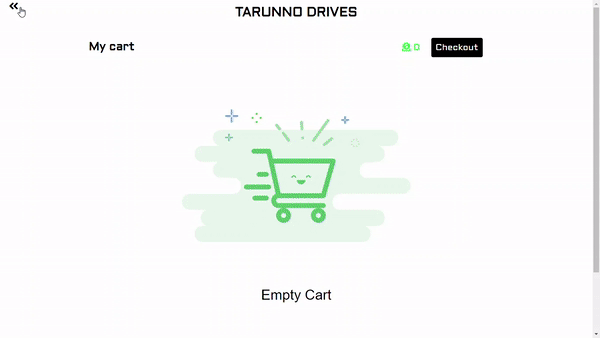
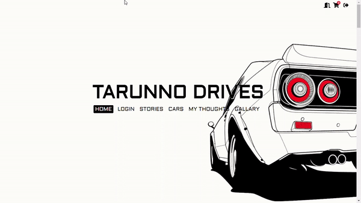

# Car-eCommerce-PHP
I have used OOP PHP for this project. So, the idea of this project was to deal with cars. Add cars and other auto parts for sell. add to Cart, get product informations.

## Main Page

## Cart

## Admin Penel

### For more views go to the Screen shots folder

The admin panel has 7 eidting option : users, orders, products, cars, my thoughts, stories and gallary. The admin can remove a member and his/her orders.
admin can add products and cars for deals. Admin can post his thoughts about cars or other cars related items. admin can also add stories to show users. I got this story concept
from BMW automobile webisite. 

### Features : CURD and CMS
I have mainly used the concept of CURD and CMS in procedural php.
features: 
        1. add, delele update items, user and thoughts. 
        2. upload post image and products images. 
        3. personal cart to show products one user added. 
        4. search cars. 
        5. admin panel for the admin to manage the contents. 
        6. Form validations 

### Front-end Features :
In front a i have used vanilla-js for interactivity
and core html, css for markup and style. 
        1. Voice search option.  
        2. Image slide show. 
        3. Carosol slider for products.  
        4. Scroll animation for smooth scroll. 
        5. Gallary to show images. 
        6. story slider. 
              
### Languages : HTML CSS JavaScript PHP and SQL
I have used core HTML CSS JavaScript and PHP in this project. There's no framework used of any of these language.
For front-end I have used HTML CSS JS and for back-end I have used PHP SQL.
I have used XAMPP as local severe and phpMyadmin for Database managment system.

### Requirement : Import the DATABASE.sql file to your phpMyadmin 
